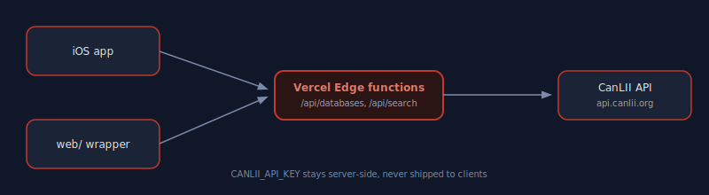

# CanLII App

A native iOS app and lightweight web wrapper for searching CanLII (Canadian case law and legislation), backed by a serverless proxy that keeps the CanLII API key off the client.

## Why

canlii.org's own site is dated and blocks scraping (403 on direct fetch). This project uses CanLII's official public API instead, proxied through Vercel so the API key never ships in the iOS app or browser bundle.

## Architecture

## Structure

- `api/` — Vercel Edge Functions proxying `api.canlii.org` (`/api/databases`, `/api/search`). Reads `CANLII_API_KEY` from env.
- `web/` — static HTML/CSS/JS wrapper, calls the same `/api` routes.
- `ios/` — SwiftUI iOS app (generated via XcodeGen, see `ios/project.yml`). Search, browse, open full decisions via Safari view, bookmark with SwiftData.

## Setup

1. Apply for a free CanLII API key: https://www.canlii.org/en/info/api.html
2. Set `CANLII_API_KEY` in Vercel project env vars (and `.env.local` for local dev).
3. Deploy: `vercel --prod` from the repo root.
4. iOS: open `ios/CanLII.xcodeproj` in Xcode and run. If you edit `ios/project.yml`, regenerate with `xcodegen generate` (run from `ios/`).

## Status

MVP scaffold — search + browse + bookmark works once `CANLII_API_KEY` is set. Build verified locally (`xcodebuild` succeeded for iOS Simulator).
