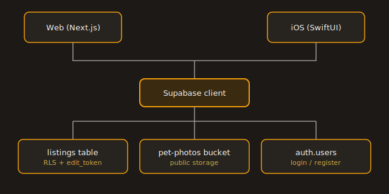

# Missing Pets

A Craigslist-style board for posting and finding lost/found pets — web app + native iOS app, shared Supabase backend.

Live at [pets.heyitsmejosh.com](https://pets.heyitsmejosh.com).

## Stack
- **Web**: Next.js 16 (App Router) + Tailwind, deployed to Vercel
- **iOS**: SwiftUI, generated via XcodeGen, uses [supabase-swift](https://github.com/supabase/supabase-swift)
- **Backend**: Supabase (Postgres + Storage), no auth — open posting with a private edit-token link (like Craigslist's edit links)

## Setup

### 1. Supabase
Create a new Supabase project, then run the migration:
```
supabase link --project-ref <your-ref>
supabase db push
```
This creates the `listings` table, the `pet-photos` storage bucket, and the `update_listing` RPC used for the resolve flow.

### 2. Web
```
cd missing-pets
cp .env.local.example .env.local   # fill in your Supabase URL + anon key
npm install
npm run dev
```

### 3. iOS
```
cd ios
xcodegen generate
open MissingPets.xcodeproj
```
Set `SUPABASE_URL` / `SUPABASE_ANON_KEY` as scheme environment variables in Xcode (Product > Scheme > Edit Scheme > Run > Arguments), then build & run.

## How it works
- Anyone can post a listing (lost or found pet) with a photo, last-seen location, color/description, and an optional tag/tattoo/chip number.
- No accounts. Posting returns a one-time edit link containing a UUID `edit_token`, used to mark the listing resolved later.
- The web list view and iOS list view both read/write the same `listings` table directly via the Supabase client — no custom API server.

## Structure


```
app/                    Next.js pages (list, post, detail, edit, login/register/reset)
lib/supabase.ts         Supabase client + Listing type
lib/AuthBar.tsx          Header auth status (log in / log out)
supabase/migrations/    SQL schema, RLS policies, storage bucket, auth column
ios/project.yml         XcodeGen spec
ios/MissingPets/        SwiftUI source
```

## Haiku
> empty board, no name —
> a stranger's cat finds a stranger
> token, then a home
