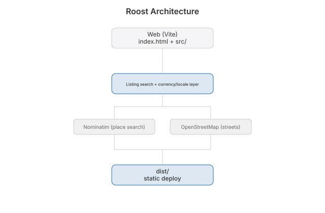

# Roost


Worldwide real estate browsing. Search any city on earth, switch between homes
for sale and rentals, and read every price in the local currency and the
local language.

## Features

- Place search anywhere on earth via Nominatim, no API key
- Real local street names pulled from OpenStreetMap for the place you browse
- Per-country currency, price levels, rental yields, and ft² vs m²
- Sale and rent modes, with price filters cut from the local market's own scale
- 26 UI languages with right-to-left support, auto-detected from the browser
- Interactive map with price pill markers, filters, favorites
- Supabase Auth (email + password, forgot password, session persistence)

## Run

```bash
npm install && npm run dev
npm run build
node src/data/listings.test.mjs
```

## Data

Listings are generated per place and seeded by its coordinates, so a city always
shows the same homes. The shape matches an MLS/IDX response, so swapping in a
real feed is a change to one function in `src/data/listings.js`.

## License

MIT 2026 Joshua Trommel

[Technical whitepaper](WHITEPAPER.md)

## API and agent tools

[`docs/API.md`](docs/API.md) documents the HTTP surface (where there is one) and
the WebMCP tools this app registers on `document.modelContext`, so an in-browser
agent can drive it. Tools are split into read-only, reversible writes, and the
few that require human confirmation.

## Architecture


